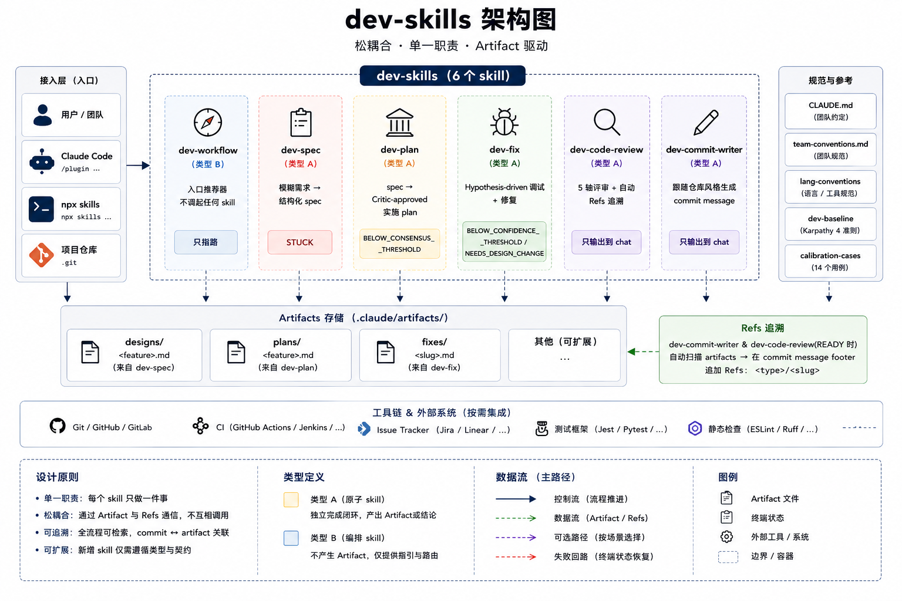
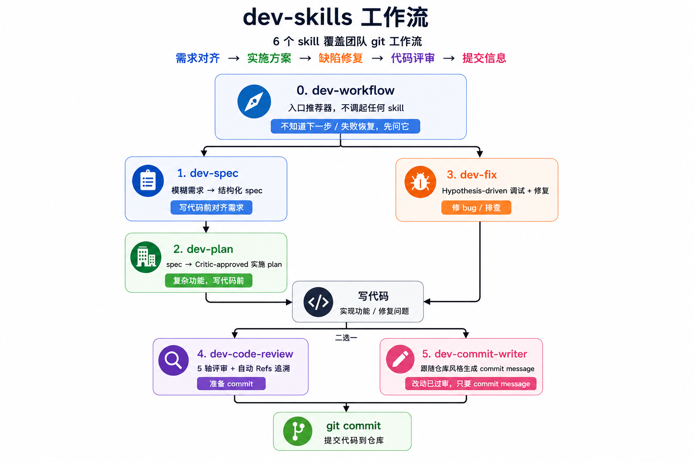

<div align="center">
  
  <p>
    6 个 skill 覆盖团队 git 工作流 ·<br/>
    <b>需求对齐 → 实施方案 → 缺陷修复 → 代码评审 → 提交信息</b>
  </p>
</div>

<p align="center">
  
  
  
  
</p>

<p align="center">
  <a href="https://jason-chen-coder.github.io/dev-skills/">Website</a>
  ·
  <a href="./docs/onboarding.md">Onboarding</a>
  ·
  <a href="./skills/dev-workflow/">Start with dev-workflow</a>
</p>

---

## Skills

|  | Skill | 一句话职责 | 触发 |
|:---:|---|---|---|
| 🧭 | [`dev-workflow`](./skills/dev-workflow/) | 入口推荐器,不调起任何 skill | 不知道下一步 / 失败恢复 |
| 📋 | [`dev-spec`](./skills/dev-spec/) | 模糊需求 → 结构化 spec | 写代码前对齐需求 |
| 🏗 | [`dev-plan`](./skills/dev-plan/) | spec → Critic-approved 实施 plan | 复杂功能,写代码前 |
| 🐛 | [`dev-fix`](./skills/dev-fix/) | Hypothesis-driven 调试 + 修复 | 修 bug / 排查 |
| 🔍 | [`dev-code-review`](./skills/dev-code-review/) | 5 轴评审 + 自动 Refs 追溯 | 准备 commit |
| ✏️ | [`dev-commit-writer`](./skills/dev-commit-writer/) | 跟随仓库风格生成 commit message | 改动已过审 |

<sub>每个 skill 只做一件事 · 通过 <code>.claude/artifacts/</code> 松耦合 · <b>不互相调用</b></sub>

---

## 🚀 安装

Claude Code 和 Codex 的安装方式**不一样**:

- Claude Code 走本仓库的 `.claude-plugin/` manifest,用 `/plugin marketplace add` + `/plugin install`。
- Codex 目前先把 `skills/*` 安装到 `$CODEX_HOME/skills`(默认 `~/.codex/skills`)。等本仓库补齐 `.codex-plugin/` 后,会再提供 Codex plugin 方式。

### Claude Code

在 Claude Code 里逐行执行:

```bash
/plugin marketplace add https://github.com/Jason-chen-coder/dev-skills
/plugin install dev-skills
```

### Codex

当前兼容方式是在 shell 里把 skill 目录复制到 Codex skills 目录:

```bash
git clone https://github.com/Jason-chen-coder/dev-skills.git
cd dev-skills
mkdir -p "${CODEX_HOME:-$HOME/.codex}/skills"
cp -R skills/* "${CODEX_HOME:-$HOME/.codex}/skills/"
```

Codex 用户如果需要团队级 always-on 规则,可以复制 `AGENTS.md.template` 到项目根的 `AGENTS.md`。

### npx skills

跨 agent CLI 安装方式:

```bash
npx skills add Jason-chen-coder/dev-skills              # 项目级
npx skills add Jason-chen-coder/dev-skills --global     # 全局
```

### 团队规则模板

Claude Code 用户别忘了手动复制团队约定模板到项目根:

```bash
curl -O https://raw.githubusercontent.com/Jason-chen-coder/dev-skills/master/CLAUDE.md.template
mv CLAUDE.md.template CLAUDE.md
```

Codex 用户复制 Codex 团队规则模板:

```bash
curl -O https://raw.githubusercontent.com/Jason-chen-coder/dev-skills/master/AGENTS.md.template
mv AGENTS.md.template AGENTS.md
```

<sub>完整安装 / 兜底方案 / 升级路径 → <a href="./docs/onboarding.md">docs/onboarding.md</a></sub>

---

## 🔄 升级

升级方式取决于你当初怎么安装。

### Claude Code

在 Claude Code 里执行:

```bash
/plugin update dev-skills
```

如果 update 后没有生效,用卸载重装兜底:

```bash
/plugin uninstall dev-skills
/plugin install dev-skills
```

### Codex

当前 Codex 兼容方式是复制 `skills/*` 到 `$CODEX_HOME/skills`,所以升级时需要重新同步这 6 个 skill 目录:

```bash
cd dev-skills
git pull --ff-only

CODEX_SKILLS_DIR="${CODEX_HOME:-$HOME/.codex}/skills"
mkdir -p "$CODEX_SKILLS_DIR"

for skill in dev-code-review dev-commit-writer dev-spec dev-plan dev-fix dev-workflow; do
  rm -rf "$CODEX_SKILLS_DIR/$skill"
done

cp -R skills/* "$CODEX_SKILLS_DIR/"
```

如果本地没有保留 `dev-skills` clone,重新跑一遍 Codex 安装步骤即可。

### npx skills

如果使用 `npx skills` 安装,优先使用 update:

```bash
npx skills update
```

如果你的 `npx skills` 版本没有 update,或遇到目录结构迁移 / skill 重命名,用 force 重新安装:

```bash
npx skills add Jason-chen-coder/dev-skills --force              # 项目级
npx skills add Jason-chen-coder/dev-skills --global --force     # 全局
```

### 模板同步

升级 skill **不会自动覆盖**你项目里的 `CLAUDE.md` / `AGENTS.md`。如果本仓库的 `CLAUDE.md.template` 或 `AGENTS.md.template` 有更新,需要人工对比后把需要的规则同步到项目根对应文件。

---

## 💡 使用

直接在对话里按需触发 skill,或先跑 `dev-workflow` 让它指路:

```text
/dev-workflow                # 不知道下一步,先问它
/dev-spec    新需求描述...    # 需求对齐 → 产出 spec
/dev-plan    spec 路径        # spec → 实施 plan
/dev-fix     bug 现象...       # hypothesis-driven 修 bug
/dev-code-review              # 提交前 5 轴评审
/dev-commit-writer            # 改动已过审,只要 commit message
```

<sub>典型链路:`dev-spec` →(可选)`dev-plan` → 写代码 → `dev-code-review` → `git commit`</sub>

---

## 🗺 架构总览

<p align="center">
  
</p>

---

## 🔄 工作流

<p align="center">
  
</p>

> **松耦合保证**:`dev-workflow` 是**纯建议器**,绝不调起任何 skill。其他 5 个 skill 的「不互调」Hard rule 100% 有效。

<details>
<summary><b>📂 中间产物路径 + 自动 Refs 追溯</b></summary>

<br/>

| Skill | Artifact |
|---|---|
| `dev-spec` | `.claude/artifacts/designs/<feature>.md` |
| `dev-plan` | `.claude/artifacts/plans/<feature>.md` |
| `dev-fix` | `.claude/artifacts/fixes/<slug>.md` |
| `dev-workflow` / `dev-code-review` / `dev-commit-writer` | 无 artifact,只输出到 chat |

`dev-commit-writer` 和 `dev-code-review`(READY 时)会扫 `.claude/artifacts/`,在 commit message footer 自动加 `Refs: <type>/<slug>`。后续可用 `git log --grep="Refs:"` 检索 commit ↔ artifact 关联。

</details>

<details>
<summary><b>🚦 模式建议</b></summary>

<br/>

| 场景 | 推荐 |
|---|---|
| 复杂功能(鉴权 / 支付 / 数据迁移 / PII) | `dev-spec` + `dev-plan --deliberate` |
| 间歇性 / 生产事故 / 跨系统 bug | `dev-fix --deep` |
| 一句话 hotfix | 跳过 spec/plan,直接 `dev-code-review` |
| 不知道该跑哪个 | `dev-workflow` |

</details>

<details>
<summary><b>🛑 失败回路(terminal status)</b></summary>

<br/>

| Skill | Terminal status |
|---|---|
| `dev-spec` | `STUCK` |
| `dev-plan` | `BELOW_CONSENSUS_THRESHOLD` |
| `dev-fix` | `BELOW_CONFIDENCE_THRESHOLD` / `NEEDS_DESIGN_CHANGE` |

任何 skill 卡住时,跑 `dev-workflow --recover [slug]`,它有完整决策表覆盖各阻塞的恢复路径。

</details>

---

## 📜 版本历史

详见 [`CHANGELOG.md`](./CHANGELOG.md)。

---

<p align="center">
  <sub>
    MIT License · <a href="./CHANGELOG.md">CHANGELOG</a> · <a href="./CONTRIBUTING.md">Contributing</a> · <a href="https://github.com/Jason-chen-coder/dev-skills/issues">Issues</a>
  </sub>
</p>

<p align="center">
  <sub>灵感来自 <a href="https://github.com/forrestchang/andrej-karpathy-skills">karpathy-skills</a> · <a href="https://github.com/yeachan-heo/oh-my-claudecode">oh-my-claudecode</a></sub>
</p>
