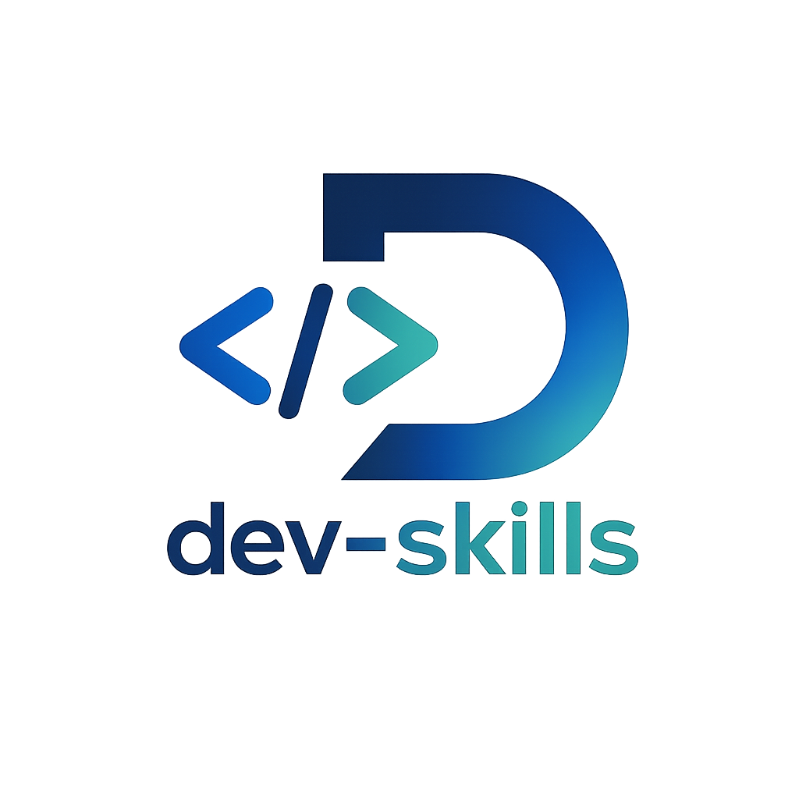

<p align="center">
  
</p>

<h1 align="center">dev-skills</h1>

<p align="center">
  6 个 skill 覆盖团队 git 工作流 ·<br/>
  <b>需求对齐 → 实施方案 → 修 bug → 代码评审 → commit message</b>
</p>

<p align="center">
  
  
  
  
</p>

<p align="center">
  <sub>灵感来自 <a href="https://github.com/forrestchang/andrej-karpathy-skills">karpathy-skills</a> · <a href="https://github.com/yeachan-heo/oh-my-claudecode">oh-my-claudecode</a></sub>
</p>

---

## Skills

|  | Skill | 一句话职责 | 触发 |
|:---:|---|---|---|
| 🧭 | [`dev-workflow`](./skills/dev-workflow/) | 入口推荐器,不调起任何 skill | 不知道下一步 / 失败恢复 |
| 📋 | [`dev-spec`](./skills/dev-spec/) | 模糊需求 → 结构化 spec | 写代码前对齐需求 |
| 🏗 | [`dev-plan`](./skills/dev-plan/) | spec → Critic-approved 实施 plan | 复杂功能,写代码前 |
| 🐛 | [`dev-fix`](./skills/dev-fix/) | Hypothesis-driven 调试 + 修复 | 修 bug / 排查 |
| 🔍 | [`dev-code-review`](./skills/dev-code-review/) | 5 轴评审 + 自动 Refs 追溯 | 准备 commit |
| ✏️ | [`dev-commit-writer`](./skills/dev-commit-writer/) | 跟随仓库风格生成 commit message | 改动已过审 |

<sub>每个 skill 只做一件事 · 通过 <code>.claude/artifacts/</code> 松耦合 · <b>不互相调用</b></sub>

---

## 🚀 安装

```bash
# Claude Code(推荐)— 在 Claude Code 里逐行执行
/plugin marketplace add https://github.com/Jason-chen-coder/dev-skills
/plugin install dev-skills

# 或 npx skills(跨 agent CLI)
npx skills add Jason-chen-coder/dev-skills              # 项目级
npx skills add Jason-chen-coder/dev-skills --global     # 全局

# 别忘了 CLAUDE.md(手动复制团队约定模板到项目根)
curl -O https://raw.githubusercontent.com/Jason-chen-coder/dev-skills/main/CLAUDE.md.template
mv CLAUDE.md.template CLAUDE.md
```

<sub>完整安装 / 兜底方案 / 升级路径 → <a href="./docs/onboarding.md">docs/onboarding.md</a></sub>

---

## 🔄 工作流

```
                    dev-workflow(可选入口,只指路)
                              │
            ┌─────────────────┴─────────────────┐
        [新需求]                              [bug 报告]
            ▼  dev-spec                          ▼  dev-fix
            ▼  dev-plan(可选)                     ▼  修代码 + regression test
            ▼  写代码
            └────────────────┬─────────────────────┘
                             ▼  二选一
                             ├─ dev-code-review     评审 + commit msg
                             └─ dev-commit-writer   只要 commit msg
                             ▼
                          git commit
```

> **松耦合保证**:`dev-workflow` 是**纯建议器**,绝不调起任何 skill。其他 5 个 skill 的「不互调」Hard rule 100% 有效。

<details>
<summary><b>📂 中间产物路径 + 自动 Refs 追溯</b></summary>

<br/>

| Skill | Artifact |
|---|---|
| `dev-spec` | `.claude/artifacts/designs/<feature>.md` |
| `dev-plan` | `.claude/artifacts/plans/<feature>.md` |
| `dev-fix` | `.claude/artifacts/fixes/<slug>.md` |
| `dev-workflow` / `dev-code-review` / `dev-commit-writer` | 无 artifact,只输出到 chat |

`dev-commit-writer` 和 `dev-code-review`(READY 时)会扫 `.claude/artifacts/`,在 commit message footer 自动加 `Refs: <type>/<slug>`。后续可用 `git log --grep="Refs:"` 检索 commit ↔ artifact 关联。

</details>

<details>
<summary><b>🚦 模式建议</b></summary>

<br/>

| 场景 | 推荐 |
|---|---|
| 复杂功能(鉴权 / 支付 / 数据迁移 / PII) | `dev-spec` + `dev-plan --deliberate` |
| 间歇性 / 生产事故 / 跨系统 bug | `dev-fix --deep` |
| 一句话 hotfix | 跳过 spec/plan,直接 `dev-code-review` |
| 不知道该跑哪个 | `dev-workflow` |

</details>

<details>
<summary><b>🛑 失败回路(terminal status)</b></summary>

<br/>

| Skill | Terminal status |
|---|---|
| `dev-spec` | `STUCK` |
| `dev-plan` | `BELOW_CONSENSUS_THRESHOLD` |
| `dev-fix` | `BELOW_CONFIDENCE_THRESHOLD` / `NEEDS_DESIGN_CHANGE` |

任何 skill 卡住时,跑 `dev-workflow --recover [slug]`,它有完整决策表覆盖各阻塞的恢复路径。

</details>

---

## 📚 文档

| 我想… | 看哪 |
|---|---|
| 30 分钟跑通第一次 | [`docs/onboarding.md`](./docs/onboarding.md) |
| 团队 always-on 约定模板 | [`CLAUDE.md.template`](./CLAUDE.md.template) |
| 团队语言 / 工具偏好 | [`references/team-conventions.md`](./references/team-conventions.md) |
| Karpathy 行为基线(4 准则) | [`references/dev-baseline.md`](./references/dev-baseline.md) |
| 季度 calibration(14 个用例,防判定漂移) | [`references/calibration-cases.md`](./references/calibration-cases.md) |
| 提议新 skill / 改 baseline | [`CONTRIBUTING.md`](./CONTRIBUTING.md) |
| 版本历史 | [`CHANGELOG.md`](./CHANGELOG.md) |

<sub><b>规范优先级</b>:项目 lint > team-conventions > lang-conventions > dev-baseline<br/>
<b>行为优先级</b>:skill 局部 > CLAUDE.md > dev-baseline</sub>

---

<p align="center">
  <sub>
    <b>类型 A</b>(原子,5 个) + <b>类型 B</b>(orchestrator,1 个 = dev-workflow) · 详见 <a href="./CONTRIBUTING.md">CONTRIBUTING</a>
  </sub>
</p>

<p align="center">
  <sub>
    MIT License · <a href="./CHANGELOG.md">CHANGELOG</a> · <a href="./CONTRIBUTING.md">Contributing</a> · <a href="https://github.com/Jason-chen-coder/dev-skills/issues">Issues</a>
  </sub>
</p>
